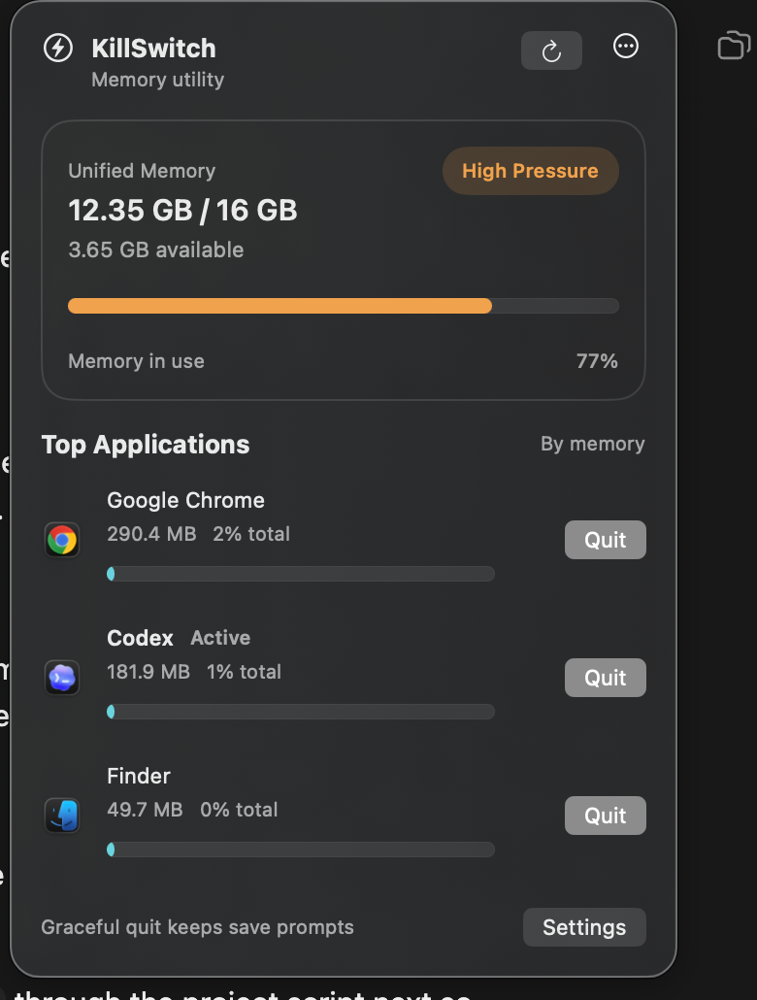

# KillSwitch

KillSwitch is a lightweight macOS menu bar utility for seeing memory pressure and quickly quitting heavy apps.

Built in Swift and SwiftUI, KillSwitch gives you a fast, native way to spot memory-heavy apps and gracefully quit them without opening Activity Monitor.



## What it does

- Shows current unified memory usage at a glance
- Maps the current system state to a pressure badge
- Lists the top memory-using user apps
- Lets you request a normal app quit without skipping save prompts
- Stays in the menu bar instead of becoming another window-heavy dashboard

## Current status

The app shell is up and running locally with:

- menu bar extra and popover UI
- live memory snapshot
- top applications list
- graceful quit buttons
- settings window
- local build/run script
- Sparkle-based in-app update checks with silent background checking

## Requirements

- macOS 14 or newer
- Full Xcode installed

KillSwitch prefers the full Xcode toolchain. The local run script auto-detects Xcode in:

- `/Applications/Xcode.app`
- `/Volumes/SSD/Applications/Xcode.app`

If your Xcode install lives somewhere else, set `DEVELOPER_DIR` before building.

## Run locally

```bash
git clone https://github.com/<owner>/KillSwitch.git
cd KillSwitch
./script/build_and_run.sh
```

Useful variants:

```bash
./script/build_and_run.sh --verify
./script/build_and_run.sh --logs
./script/build_and_run.sh --debug
```

## Project layout

```text
Sources/KillSwitch/
├── App/
├── Models/
├── Services/
├── ViewModels/
├── Views/
└── Support/
```

Supporting scripts live in `script/`, and the product spec lives in [killswitch_prd.md](killswitch_prd.md).

## Release path

The repo includes GitHub Actions for:

- CI builds on macOS
- Packaging a release `.app` into a zip artifact
- Optional signing and notarization when Apple secrets are present
- Generating and publishing a Sparkle `appcast.xml` feed for in-app updates
- Generating a Homebrew cask file from the release artifact checksum
- Optionally publishing that cask into a Homebrew tap when tap secrets are present

See [docs/release.md](docs/release.md) for the release and Homebrew flow.

## Homebrew cask

The intended distribution path is:

1. Ship a tagged GitHub Release with `KillSwitch.zip`
2. Generate the matching `killswitch.rb` cask file from that artifact
3. Optionally publish that cask into your tap automatically from GitHub Actions
4. Install with `brew install --cask <tap>/killswitch`

The release workflow generates the cask file for you once the repo slug and release artifact exist. If `HOMEBREW_TAP_REPOSITORY` and `HOMEBREW_TAP_GITHUB_TOKEN` are configured in GitHub Actions secrets, it will also commit the generated cask into that tap.

## Open questions before public release

- Choose the public GitHub repo slug
- Choose the Homebrew tap repository slug
- Choose an open-source license
- Finalize signing and notarization secrets for release builds
